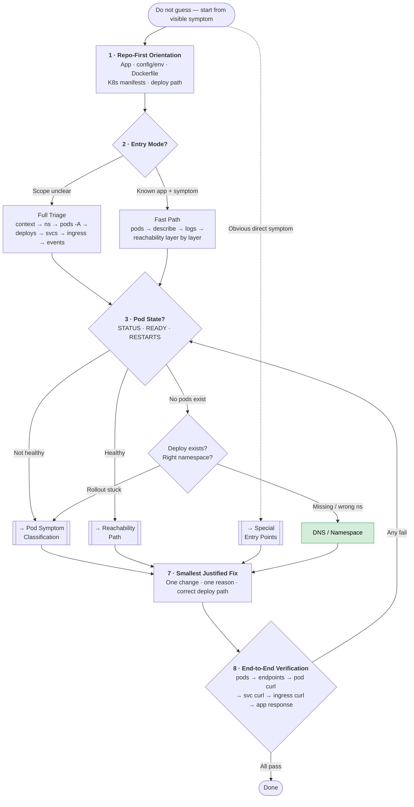
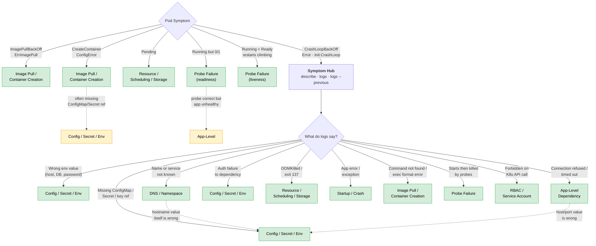
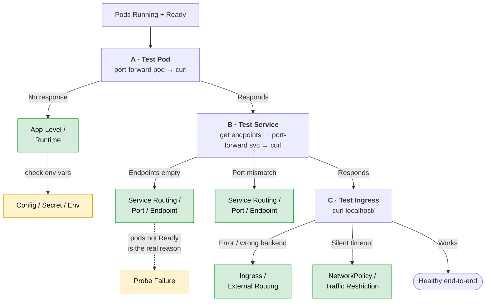
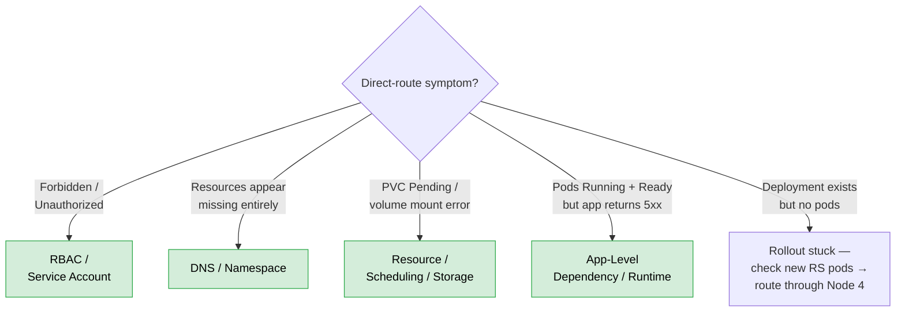

# Troubleshooting Routing Tree — Mermaid Diagrams

Diagrams match the routing structure in `troubleshooting-routing-tree.md`.
Green nodes = root-cause domains. Yellow dotted lines = reroutes (surface symptom misleads, real cause is elsewhere).

---

## Master Flow

---

## Pod Symptom Classification (Node 4 + 4a)

CrashLoopBackOff is a **symptom hub** — logs decide the real root-cause branch.

---

## Reachability Path (Node 5)

Test layer by layer when pods are healthy. Stop at the first layer that fails.

---

## Special Entry Points (Node 6)

Symptoms that bypass the main pod-state → reachability flow.

